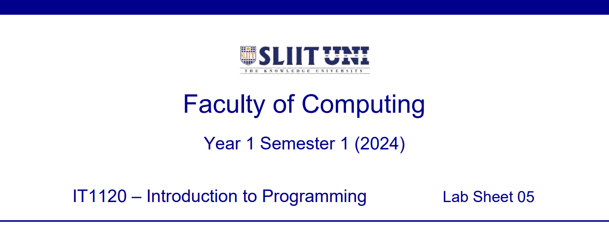
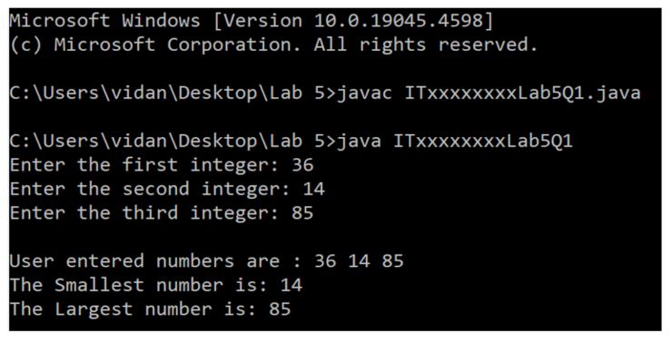
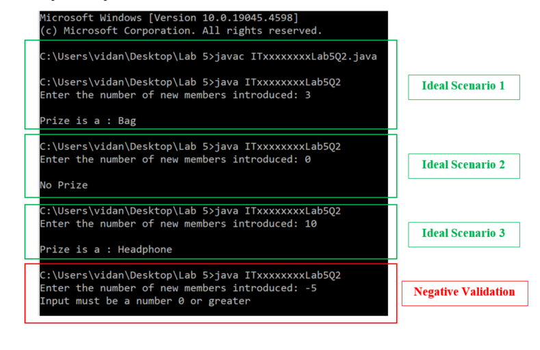
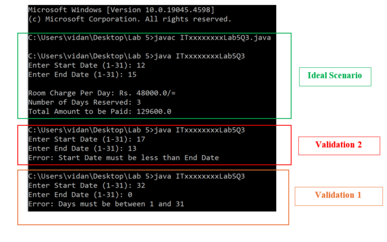

  

    
  

### Question 1 (Tutorial 4 -- Q1)

Write a Java program to read three different integers from the keyboard
and compute the smallest and largest of these numbers.

Save the file inside '**Lab 5**' folder as: **ITxxxxxxxxLab5Q1.java**

Replace 'ITxx xxx xxx' of the filename, with your own Student ID.

Expected Output:

  

    
  

### Question 2 (Tutorial 4 -- Q2)

A credit card company has a promotion for existing customers to
introduce new members. Prizes are given to the customers depending on
the number of new members they introduce. For example, if a customer has
introduced 3 people, then he/she is entitled to a: Bag.

| New Member Count                 | Prize                             |
| -------------------------------- | --------------------------------- |
| 0                                 | No Prize                          |
| 1                                 | Pen                               |
| 2                                 | Umbrella                          |
| 3                                 | Bag                               |
| 4                                 | Travelling Chair                  |
| >= 5                              | Headphone                         |

Write a Java program using **[SWITCH statement]** to input
the number of new members a customer has introduced and print the prizes
the customer is entitled to. Validate the entered number (should be
greater than or equal to 0).

Save the file inside '**Lab 5**' folder as: **ITxxxxxxxxLab5Q2.java**

Replace 'ITxx xxx xxx' of the filename, with your own Student ID.

Expected Output:

  

    
  

### Question 3 (Tutorial 4 -- Q3)

Ransiri Resort offers discount for full board reservations during the
month of December as shown below. Discount is given only for the
reservations done for more than 3 days. Room charges per day is Rs
48,000.00.

| No of Days Reserved | Discount Rate (%) |
| ------------------- | ----------------- |
| < 3 days            | No discount       |
| 3 – 4 days          | 10                |
| 5 or more           | 20                |

Write a Java program to enter the start date (day) and end date (day) of
the reservation and find out the number of days reserved and the total
amount to be paid. Use **[CONSTANTS]}** to declare fixed
values.

After the start date and end dates are entered, validate the below
conditions. If the conditions fail, display error messages and exit from
the program.

Validation 1 -- **Start date and end date cannot be less than 1 or
greater than 31**

Validation 2 -- **Start date should be less than the end date**

Save the file inside '**Lab 5**' folder as: **ITxxxxxxxxLab5Q3.java**

Replace 'ITxx xxx xxx' of the filename, with your own Student ID.

Expected Output:

  

    
  

  

    
  

